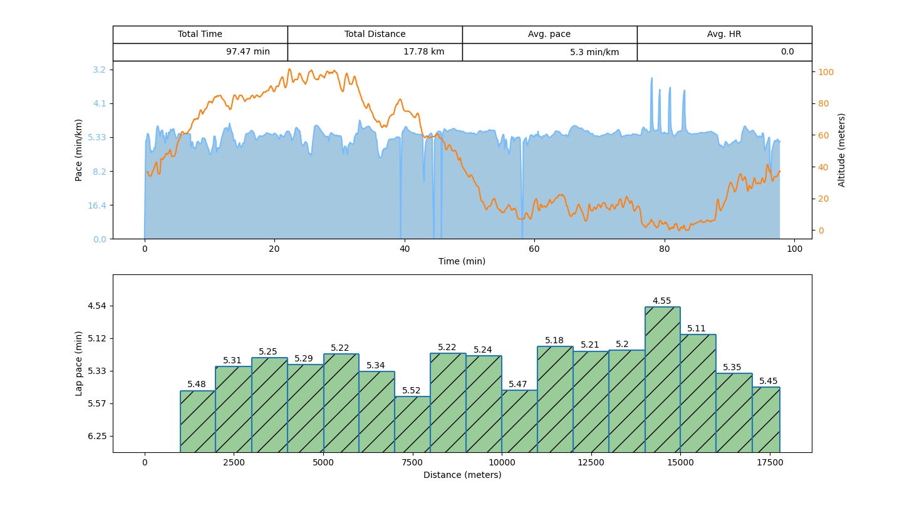
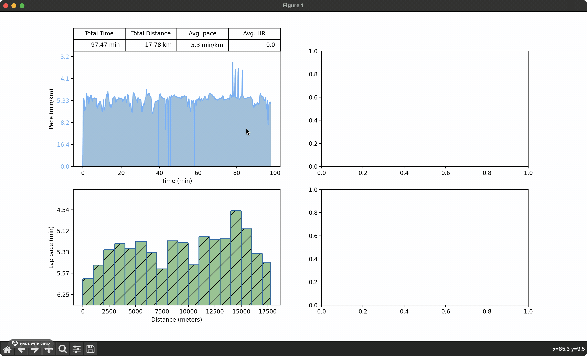

# RunData

### Summary:

RunData is a small c++ library made for extracting data from the .tcx files produced by my Garmin GPS watch. Using Cython, it can easily be compiled to a Python module, which is how I mainly use it. 

### Examples

A matplotlib visualisation of a run made by using the Python module:

An interactive example:

The code for these are in the 'python' folder.

### Documentation:

For an overview take a look in the 'main/include' folder. 

### Disclaimer

This is very much a hobby project in developement. 

